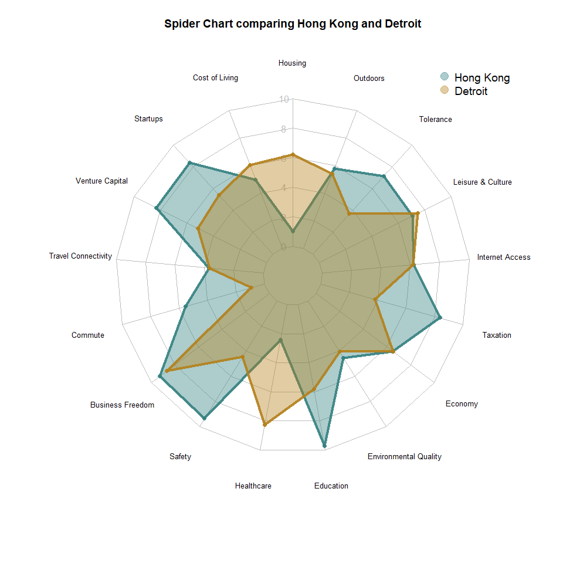

<!-- README.md is generated from README.Rmd. Please edit that file -->

# teleporrrt

<!-- badges: start -->

<!-- badges: end -->

The goal of teleporrrt is to construct detailed visuals and convey
information from the *Teleport API*

## Installation

You can install the development version from
[GitHub](https://github.com/) with:

``` r
# install.packages("devtools")
devtools::install_github("DeclanMolony/teleporrrt")
```

``` r
library(teleporrrt)
```

## Cities in the Teleport API

You can use the function `city_lookup()` to produce a dataframe of all
the cities used in the Teleport API, and their html links.

``` r

#city_lookup()
```

Or you can use `cities_valid()` to check whether a particular city is in
the Teleport API

``` r
cities_valid(cities = "Constantinople")
#> [1] "FALSE"
```

## Individual City Links

You can use the function `city_link()` to produce an html link for a
particular city’s scores to be used for your own analysis:

``` r
city_link("Dublin")
#> [1] "https://api.teleport.org/api/urban_areas/slug:dublin/scores/"
```

## Dataframes

You can create a dataframe of a single city’s Teleport metrics:

``` r
city_dataframe("New York")
#>   Housing Cost of Living Startups Venture Capital Travel Connectivity Commute
#> 1       1          2.342       10              10               6.675 5.51925
#>   Business Freedom Safety Healthcare Education Environmental Quality Economy
#> 1            8.671  7.022   8.501667    8.0935               5.23375  6.5145
#>   Taxation Internet Access Leisure & Culture Tolerance Outdoors
#> 1   3.9205          7.0985                10    6.7125   5.7475
```

Or create a dataframe comparing two cities:

``` r
city_combine_df("Cairo","Zurich")
#>           Housing Cost of Living Startups Venture Capital Travel Connectivity
#> Max score  10.000             10  10.0000          10.000             10.0000
#> Min score   0.000              0   0.0000           0.000              0.0000
#> Cairo      10.000             10   5.0985           2.958              3.7575
#> Zurich      1.473              1   6.2035           3.872              7.7335
#>            Commute Business Freedom  Safety Healthcare Education
#> Max score 10.00000        10.000000 10.0000  10.000000   10.0000
#> Min score  0.00000         0.000000  0.0000   0.000000    0.0000
#> Cairo      3.99025         5.790667  6.7910   2.897333    0.5000
#> Zurich     5.83950         8.888000  9.0665   9.739333    7.2875
#>           Environmental Quality Economy Taxation Internet Access
#> Max score               10.0000  10.000  10.0000         10.0000
#> Min score                0.0000   0.000   0.0000          0.0000
#> Cairo                    1.1555   2.978   5.1010          2.4050
#> Zurich                   8.6430   6.552   6.4285          7.2675
#>           Leisure & Culture Tolerance Outdoors
#> Max score           10.0000   10.0000   10.000
#> Min score            0.0000    0.0000    0.000
#> Cairo                6.1855    2.6500    0.500
#> Zurich               4.9655    8.7845    5.401
```

Or create a dataframe with the closest City to a given
Longitude/Latitude coordinates

``` r
#Coordinates of the White House
nearest_city(lat = 38.8977, lon = -77.0365)
#>      nearest_city       distance_km 
#> [1,] "Washington, D.C." "0.28774607"
```

## Spider Chart

You can even create a radar/spider chart comparing two cities’ scores

``` r
city_radarchart("Hong Kong","Detroit")
```



## City Ratings

You can input a list of cities you’re interested in comparing based on
cost of living, housing, or education, and find out which of the cities
has the maximum rating and which has the minimum rating

``` r
MaxMinRating(c("Toronto", "Vancouver"), "Cost of Living")
#> [1] "Maximum cost of living rating: 5.271 (Toronto)"  
#> [2] "Minimum cost of living rating: 5.259 (Vancouver)"
```
